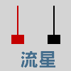

# **股票手札**

| 股票術語 | 意義                 |
| -------- | :------------------- |
| 多       | 漲                   |
| 空       | 跌                   |
| 多頭     | 未來看漲             |
| 空頭     | 未來看跌             |
| 反彈     | 短暫的回升           |
| 反轉     | 空轉多，或由多轉空   |
| 壓力線   | 股價停止上漲甚至回跌 |
| 支撐線   | 股價停止下跌甚至上漲 |

 

# **選股指標**

## 目錄

| 英文代稱       | 中文代稱 |                                    公式 |
| -------------- | :------: | --------------------------------------: |
| PER            | [本益比](#本益比) |  本益比(PER) = 每股市價 / 每股盈餘(EPS) |
| Dividend yield |  [殖利率](#殖利率)  | 現金殖利率(%) = 現金股利(元) / 股價(元) |
| Gross margin | [毛利率](#毛利率) | 毛利率(%) = (營收-營業成本)/營收
| ROE | [股東權益報酬率](#股東權益報酬率) | 股東權益報酬率  (ROE) = 稅後盈餘(稅後淨利) / 股東權益
Debt ratio | [負債比](#負債比) | 負債比(%) = 總負債 / 總資產
EPS | [每股盈餘](#每股盈餘) | 每股盈餘(EPS) = 稅後淨利 / 在外流通股數
|  | 

***

## **本益比**
### `公式 = 股價(元) / 收益(EPS)`
> 收益：意思是你手上的每1股股票今年賺了多少錢

### 1. 作用   
- 可以幫助你快速判斷股價現在是昂貴或是便宜。
- 本益比的意義等於需要多久`回本`。

### 2. 使用時注意
-  正確的本益比計算應該使用「`預估未來EPS`」.如果要使用過去EPS請參考`過去4季的EPS`。

- `虧損或是獲利高低很不穩定的股票，不適合用本益比評價。`
    Ex: `EPS < 1`

- 注意兩點差異
    - 安全性：
        獲利越安全穩定的公司，市場傾向給它更低的報酬率，也就是更高的本益比。
        想像一下如果買一間公司的股票跟買債券一樣安全，那股票和債券報酬率應該會差不多低。
    - 成長性：
        當成長性越高，價格上升，本益比通常也越高。
        若一間公司成長性差、穩定性低，本益比小於15實際上很昂貴。
        反之若成長性超強，那本益比就算30倍也可能是撿便宜。
- 觀察一間公司股價高低可以參考它`自身歷史的本益比`，以及`同業的本益比`。

- `對於獲利穩定的股票，直接用本益比估價沒有問題`，但要注意好公司通常不容易有便宜價格出現，因此`出現便宜價格時`一定要去查查`背後的原因是否會讓獲利整個長期衰退`。

### 3. 操作
- 基本上是越`低`越好，但此條件僅用在安全穩定的公司。

<!-- -------------------------------- -->
## **殖利率**
### `公式 = 現金股利(元) / 股價(元)`

> 現金股利：就是公司將獲利中多餘的資金配發給股東

### 1. 作用
- 把一筆錢長期投入股市，每年能拿回的利息。
＊ 「現金殖利率」不代表股票的「投資報酬率」。

### 2. 使用時注意
- `衰退中的公司`股價通常會一直跌、本益比也低，看起來殖利率高。

- 殖利率的公式是用最近一年的股利下去算，但獲利`如果只看最近的一年很可能會失真`

- 殖利率高於4%才算比較理想的數字。
### 3. 操作
- 檢查前三年的殖利率，基本上越`高`越好，不過如果`殖利率高`檢查公司這期間是否`負成長`。

- 若殖利率能 > `5%` 最好

<!-- -------------------------------- -->

## **毛利率**
### `公式 = (營收-營業成本)/營收`

### 1. 使用時注意
- 毛利率愈高，競爭力愈強；毛利率愈低，愈容易受到外界波動受影響。
### 2. 操作
- 找毛利率`高`的

<!-- ----------------------------- -->

## **股東權益報酬率 ROE**
### `公式 = 稅後盈餘 / 股東權益`

> 稅後盈餘：就是公司本期賺的獲利，稅後盈餘/股數就等於EPS每股盈餘

> 股東權益：代表還完負債後公司的淨值

### 1. 作用
- 評估公司的賺錢效率
### 2. 使用時注意
- ROE`不能`單獨使用，必須`搭配其他的指標`一起參考。
- ROE提高，是否是來自`一次性`的獲利?
- ROE提高時，`負債`是否有增加
### 3. 操作 
- ROE使用上有很多限制，僅能做大致的參考，並非越高越好

## **負債比**
### `公式 = 總負債 / 總資產`
1. 操作
- 負債比率 70%以上，在股災時期腰斬機率高達 30%，跌幅比一般股票大，其他時候則沒有明顯的趨勢。 
(＊負債比只是個很粗略的指標，用來降低風險效果很有限！)

<!-- ----------------------------- -->

## **每股盈餘 EPS**
### `公式 = 本期稅後淨利 / 普通股在外流通股數`

### 1. 作用
- 快速幫我們瞭解規模大小不同的`公司幫股東賺錢的能力`的差異
- 為什麼`EPS很重要`? 股價跟公司獲利能力直接相關

### 2. 使用時注意
- 稅後淨利在計算時要先扣掉`特別股股利`，因為公司的`特別股配息`通常類似`借貸利息的債務`，會優先於普通股股東的利潤分配。
> 本期稅後淨利 = 稅後淨利 – 特別股股利

- EPS要穩定，小心EPS忽高忽低的股票，EPS突然`大幅衰退`，要格外留意原因，如果是`暫時性的衰退`通常會是很好的`進場點`。

- 注意`淨利`與`現金流`的落差，如果賺了100元，但實際現金流入只有30元，這種狀況就要留意，也許是存貨或者應收帳款過多。

### 3. 操作 
- 選股判斷`本益比低`的，`EPS持續成長`的

<!-- -------------------------------------------- -->

# **進出場指標**

| 英文代稱       | 中文代稱                 |  
| --------------| -----------------------:| 
| MA            | [移動平均線](#移動平均線) |  
| 蠟燭線         |  [K 線](#K線)           | 
| Imperial Age   |  03:30                 |   

## **移動平均線**

`公式 N日移動平均線 = N天的收盤價總和 / N天`

### 1. 區分

-   短期均線： 5、10 日
-   中期均線： 20、60 日
-   長期均線： 120、240 日

### 3. 操作

- 黃金交叉： 收盤價 > 5 日均線 > 20 日均線：漲( 5 日由下往上穿過 20 日，如果近期穿過60日，則表示`大漲`)
- 死亡交叉： 收盤價 < 5 日均線 < 20 日均線：跌( 5 日由上往下穿過20 日)
- 5 日均線 < 收盤價 < 20 日均線：平穩
- 當`走勢向下`時，股價跌破 5 日線，要減碼賣出，一旦跌破 10 日線，要全部賣出，暫作觀望。
＊ 走勢向下：5日線 20日線 60日線平行並往下
- 當股價`反彈(短暫回升)`到移動平均線附近時，表示`賣盤`將湧出，促使股價進一步下跌。
- 在多頭市場中，股價跌破10日移動平均線而未跌破30日移動平均線，且30日移動平均線仍向右上方挺進，說明股價下跌是技術性回檔，跌幅不致太大，此時為買入時機。

<!-- ----------------------------- -->
## **K線**

### 1. 作用
    K 線隨時間連在一起，就可以看出股價過去的走勢圖

### 2. 使用時注意
    如果影線就越長，表示波動程度越大，注意股票公司訊息。
    

### 3. K線類型與操作

**吊人線**

-   時機： 

    在 `連續上漲` 的過程中出現一根吊人線，未來 5-9 天如果 `突破` 吊人線高點表示續漲，反之則下跌，

-   操作： 

 

**流星線**
-   時機： 

    - 流星線形態出現在`短期的上升趨勢`,它發出警告信號,表明`股價頂部`就在眼前。
    
    - 通常出現在`頂部`,當大市已有一段升幅之後,一旦出現流星線,往往預示著趨勢可能`下跌`且準確性較高。

-   操作： 

    不管出現`陰線`或`陽線`都表示即將`下跌`，判斷是否賣出

**十字線**

> 波段上漲：起漲點算起，上漲 30%以上才能稱為波段上漲

-   時機： 

    -   當一支股票已經 `波段上漲 / 波段下跌` 之後，出現十字線，則有`反轉`的意義

    -   當一支股票還未 `波段上漲 / 波段下跌` ，這時出現的十字線則是 `中繼` 的意義，也就是 `中間繼續` 的意思。

-   操作： 

**天地劍線**

-   時機： 

    -   在`走勢下跌或反彈`時出現天劍線，代表空頭中開始出現`多頭`的力道。
    -   在`多頭上漲或反彈`時出現天劍線，代表多頭中`空頭`力道逐漸表態。

    - **出現以下四點變盤機會高：**
    1. 劍線出現當天若 `爆大量`，變盤的機會更高。
    2. `隔日若又出現天劍線`，變盤的機會也更高。
    3. `多頭上漲時`出現天劍線，`隔日開盤向下跳空`，則`下跌`可能性大大提高，
    4. `空頭下跌時`出現天劍線，隔日開盤跳空大漲，則`上漲`的機會也提高。

-   操作： 

**墓碑線**

> 大部分會出現在弱勢或將下跌的股票上

-   時機： 

    在 `波段上漲30%` 之後，出現墓碑線，且墓碑線的上引線超過 5%(長上引線)，表示將 `大量下跌`

-   操作： 

    -   立即賣出
    

**跳空缺口**

## **乖離率**

>當股價漲離`平均成本`很多的時候，就可能會有大的獲利`賣壓出現`，讓股價往均線跌回。

> 當股價跌出`平均成本`太多的時候，攤平或逢低的`買盤可能會進入`，讓股價往均線漲回，這樣的狀況會使股價向平均成本靠近。

`乖離率告訴我們 股票是不是漲太多了`
`公式 = (目前股價 - 移動平均線股價)/移動平均線股價`

### 1. 使用時注意
- 比較均線與乖離率，天數必須相同。
- 對於股價長期處於`盤整`或`緩漲緩跌`的情況下，乖離率無法發揮效果。
### 2. 類別
- 當收盤價`大於`移動平均價時的乖離，稱為 正乖離。
- 當收盤價`小於`移動平均價時的乖離，稱為 負乖離。
### 3. 操作
- 當股價觸碰到「正乖離線」，不要 追高買進，未來幾天可能會有一波 股價下跌的修正。
- 當股價觸碰到「負乖離線」，不要 殺低賣出，未來幾天可能會有一波 股價上漲的反彈。