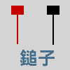
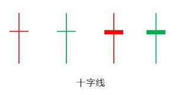
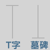

# **股票手札**

| 股票術語 | 意義                 |
| -------- | :------------------- |
| 多       | 漲                   |
| 空       | 跌                   |
| 多頭     | 未來看漲             |
| 空頭     | 未來看跌             |
| 反彈     | 短暫的回升           |
| 反轉     | 空轉多，或由多轉空   |
| 壓力線   | 股價停止上漲甚至回跌 |
| 支撐線   | 股價停止下跌甚至上漲 |

 

# **選股指標**

## 目錄

| 英文代稱       | 中文代稱 |                                    公式 |
| -------------- | :------: | --------------------------------------: |
| PER            | [本益比](#本益比) |  本益比(PER) = 每股市價 / 每股盈餘(EPS) |
| Dividend yield |  [殖利率](#殖利率)  | 現金殖利率(%) = 現金股利(元) / 股價(元) |
| Imperial Age   |  03:30   |                                    1000 |

***

## 本益比
### `公式 = 股價(元) / 收益(EPS)`
> 收益：意思是你手上的每1股股票今年賺了多少錢

### 1. 作用   
- 可以幫助你快速判斷股價現在是昂貴或是便宜。
- 本益比的意義等於需要多久＂回本＂。

### 2. 使用時注意
    一、 正確的本益比計算應該使用「預估未來EPS」.如果要使用過去EPS請參
        ＂過去4季的EPS合計＂。
    二、 虧損或是獲利高低很不穩定的股票，不適合用本益比評價。
        Ex: ＂EPS小於1時＂
    三、 注意兩點差異
        - 安全性：
            獲利越安全穩定的公司，市場傾向給它更低的報酬率，也就是更高的本益比。
            想像一下如果買一間公司的股票跟買債券一樣安全，那股票和債券報酬率應該會差不多低。
        - 成長性：
            當成長性越高，價格上升，本益比通常也越高。
            若一間公司成長性差、穩定性低，本益比小於15實際上很昂貴。
            反之若成長性超強，那本益比就算30倍也可能是撿便宜。
    四、 觀察一間公司股價高低可以參考它自身歷史的本益比，以及同業的本益比。
    五、 對於獲利穩定的股票，直接用本益比估價沒有問題，但要注意好公司通常不容易有
        便宜價格出現，因此出現便宜價格時一定要去查查背後的原因是否會讓獲利整個長期衰退。

***

## 殖利率
### `公式 = 現金股利(元) / 買進股價(元)`
> 現金股利：就是公司將獲利中多餘的資金配發給股東
### 1. 作用
- 把一筆錢長期投入股市，每年能拿回的利息。
＊ 「現金殖利率」不代表股票的「投資報酬率」。

### 2. 使用時注意
    一、 現金殖利率並沒有考慮到股價本身漲跌的賺或賠，只考慮拿到多少現金股利。
    二、 殖利率高於4%才算比較理想的數字。

# **進出場指標**

## 均線

`公式 均線 = N天的收盤價總和 / N天`

### 1. 類型

-   短期均線： 5、10 日
-   中期均線： 20、60 日
-   長期均線： 120、240 日

### 2. 操作

    -   收盤價>5 日均線>10 日均線：漲( 5 日由下往上穿過 10 日)
    -   收盤價<5 日均線<10 日均線：跌( 5 日由上往下穿過 10 日)
    -   5 日均線<收盤價<10 日均線：平穩
    -   當股價跌破 5 日線，要減碼賣出，一旦跌破 10 日線，要全部賣出，暫作觀望。

## K 線

### 1. 作用
    K 線隨時間連在一起，就可以看出股價過去的走勢圖

### 2. 使用時注意
    如果影線就越長，表示波動程度越大，注意股票公司訊息。
    

### 3. K線類型與操作

**吊人線**

-   時機： 

    在 `連續上漲` 的過程中出現一根吊人線，未來 5-9 天如果 `突破` 吊人線高點表示續漲，反之則下跌，

-   操作： 

 

**流星線**
-   時機： 

    - 流星線形態出現在`短期的上升趨勢`,它發出警告信號,表明`股價頂部`就在眼前。
    
    - 通常出現在`頂部`,當大市已有一段升幅之後,一旦出現流星線,往往預示著趨勢可能`下跌`且準確性較高。

-   操作： 

    不管出現`陰線`或`陽線`都表示即將`下跌`，判斷是否賣出

**十字線**

> 波段上漲：起漲點算起，上漲 30%以上才能稱為波段上漲

-   時機： 

    -   當一支股票已經 `波段上漲 / 波段下跌` 之後，出現十字線，則有`反轉`的意義

    -   當一支股票還未 `波段上漲 / 波段下跌` ，這時出現的十字線則是 `中繼` 的意義，也就是 `中間繼續` 的意思。

-   操作： 

**天地劍線**

-   時機： 

    -   在`走勢下跌或反彈`時出現天劍線，代表空頭中開始出現`多頭`的力道。
    -   在`多頭上漲或反彈`時出現天劍線，代表多頭中`空頭`力道逐漸表態。

    - **出現以下四點變盤機會高：**
    1. 劍線出現當天若 `爆大量`，變盤的機會更高。
    2. `隔日若又出現天劍線`，變盤的機會也更高。
    3. `多頭上漲時`出現天劍線，`隔日開盤向下跳空`，則`下跌`可能性大大提高，
    4. `空頭下跌時`出現天劍線，隔日開盤跳空大漲，則`上漲`的機會也提高。

-   操作： 

**墓碑線**

> 大部分會出現在弱勢或將下跌的股票上

-   時機： 

    在 `波段上漲30%` 之後，出現墓碑線，且墓碑線的上引線超過 5%(長上引線)，表示將 `大量下跌`

-   操作： 

    -   立即賣出
    

**跳空缺口**

